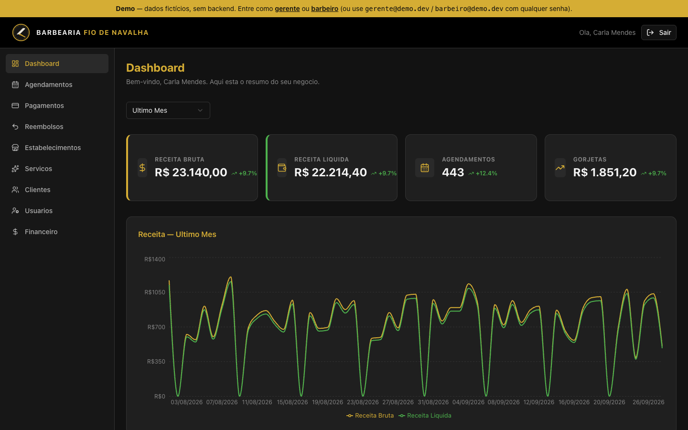
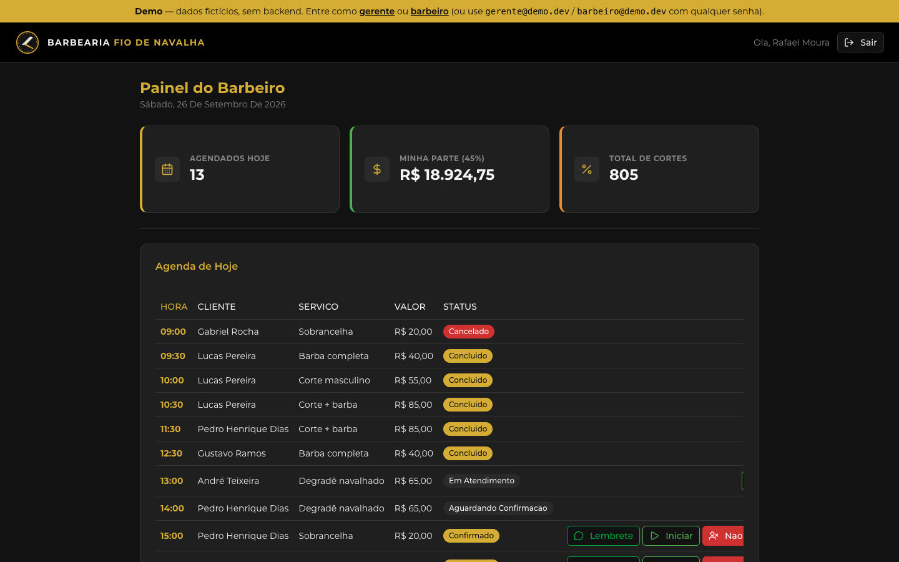
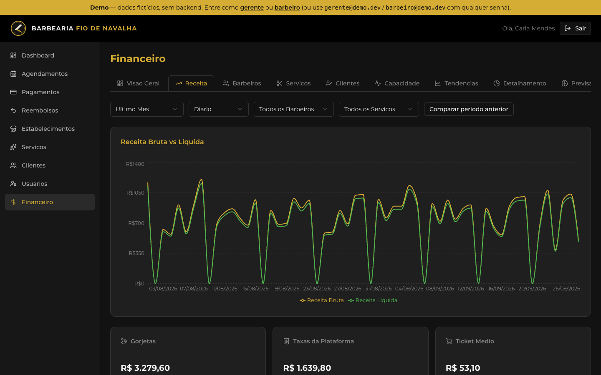
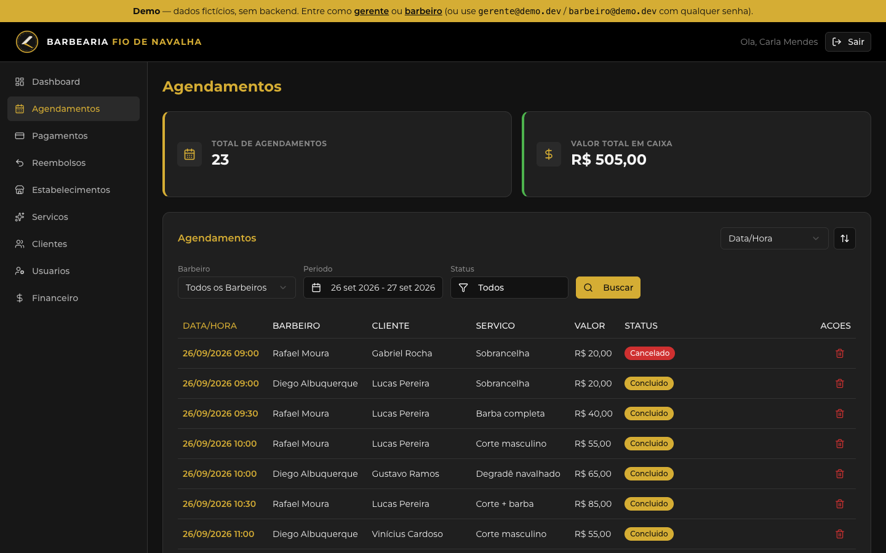
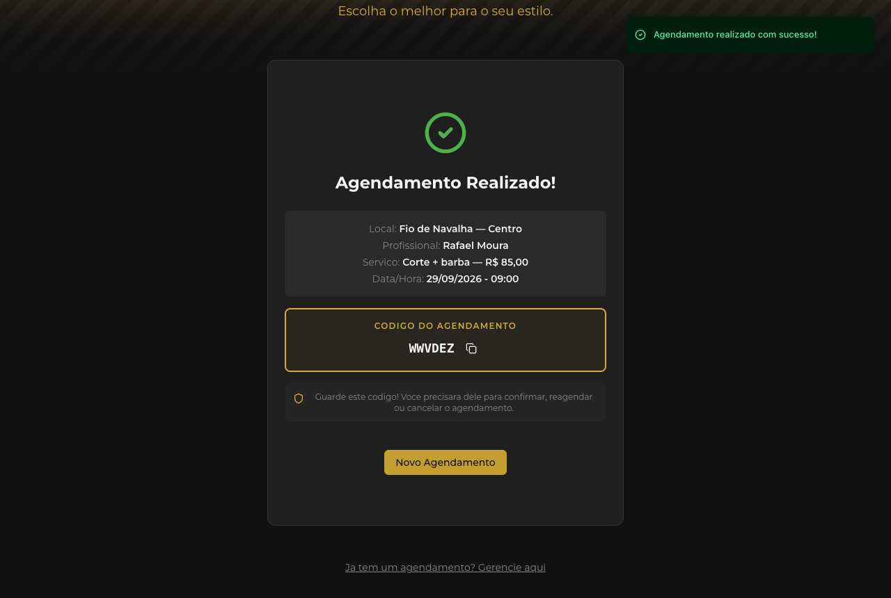

# Barbearia — barbershop booking & management (web)

**English** · [Português](README.pt-BR.md)

[](https://github.com/FabianoArthur/barbearia-frontend/actions/workflows/ci.yml)
[](https://fabianoarthur.github.io/barbearia-frontend/)
[](LICENSE)

The web client for a barbershop: customers **book online** without an account,
barbers follow **today's agenda**, and managers run the shop from **dashboards**
for appointments, schedules, staff, payments and finance. The UI is in
Brazilian Portuguese. "Barbearia Fio de Navalha" is a fictional brand; its name,
logo and backdrop live in [`src/config/brand.ts`](src/config/brand.ts).

> **Try it without installing anything:** the
> [live demo](https://fabianoarthur.github.io/barbearia-frontend/) runs entirely
> in the browser against an in-memory API with invented data. Use the banner
> links to sign in as the manager or the barber.


## Why it is interesting

- **A real scheduling flow.** A six-step booking wizard picks the shop,
  service, barber, day and a free slot (availability comes from the API), then
  validates the customer's name, CPF and Brazilian phone number with `zod` and
  `libphonenumber-js`, and hands back a confirmation code.
- **Session handling done carefully.** Auth lives in cookies. Every request
  carries a CSRF header. When requests fail with 401 at the same time, they
  share **a single** refresh call and are then retried. This is covered by
  tests in [`src/lib/api.test.ts`](src/lib/api.test.ts).
- **A live barber agenda.** The barber's screen subscribes to server-sent
  events and falls back to polling when the stream drops.
- **Manager analytics.** Revenue, bookings, tips and fees, compared with the
  previous period, plus per-barber and per-service breakdowns (Recharts).
- **A demo mode with no backend.** With `VITE_DEMO=true` the axios client talks
  to a deterministic in-memory API
  ([`src/demo`](src/demo)). It is loaded behind a static flag, so the
  production bundle does not contain it, and CI checks that.

## Screenshots

| Manager dashboard                                                                                                             | Barber agenda                                                                                                           |
| ----------------------------------------------------------------------------------------------------------------------------- | ----------------------------------------------------------------------------------------------------------------------- |
|  |  |
| **Finance — revenue**                                                                                                         | **Appointments**                                                                                                        |
|                |          |
| **Booking — pick a time**                                                                                                     | **Booking — confirmation**                                                                                              |
|                                          |                      |

## Architecture

<picture>
  <source media="(prefers-color-scheme: dark)" srcset="docs/assets/architecture-dark.svg">
  
</picture>

| Layer  | Choice                                                               |
| ------ | -------------------------------------------------------------------- |
| UI     | React 19, Tailwind CSS 4, Radix primitives (shadcn/ui), lucide icons |
| Data   | SWR for server state, Zustand for the selected shop, axios           |
| Forms  | react-hook-form + zod                                                |
| Charts | Recharts                                                             |
| Build  | Vite (rolldown), TypeScript strict                                   |
| Tests  | Vitest + Testing Library (jsdom)                                     |

```
src/
  features/        one folder per area: auth, booking, confirmation, barber, manager/*
    <area>/        Page.tsx · components/ · hooks.ts (SWR) · services.ts (axios) · schemas.ts (zod)
  components/      ui/ (shadcn primitives), layout/, shared/ (charts, banners)
  lib/             axios client + refresh interceptor, formatting, error messages
  stores/          Zustand store for the selected shop
  demo/            in-memory API used only by the demo build
```

The REST API is a separate project. [`api.json`](api.json) is its OpenAPI
contract.

## Getting started

Requirements: Node.js 22+ and npm.

```bash
npm ci
cp .env.example .env    # point VITE_API_URL at your API
npm run dev
```

No backend? Run the demo locally:

```bash
VITE_DEMO=true npm run dev
```

| Variable                  | Purpose                                                        |
| ------------------------- | -------------------------------------------------------------- |
| `VITE_API_URL`            | Base URL of the REST API (default `http://localhost:3000/api`) |
| `VITE_ENV`                | `production` turns on reCAPTCHA v3 in the booking flow         |
| `VITE_RECAPTCHA_SITE_KEY` | reCAPTCHA v3 **site** key (public by design)                   |
| `VITE_DEMO`               | `true` swaps the API for the in-memory demo                    |
| `VITE_BASE_PATH`          | Base path when served from a sub-folder (GitHub Pages)         |

## Scripts

| Command                           | What it does                            |
| --------------------------------- | --------------------------------------- |
| `npm run dev`                     | Dev server with hot reload              |
| `npm run build`                   | Type-check and production build         |
| `npm run build:demo`              | Build with the in-memory API            |
| `npm run test` / `test:run`       | Vitest in watch mode / once             |
| `npm run lint`                    | ESLint (typescript-eslint, react-hooks) |
| `npm run typecheck`               | `tsc -b`                                |
| `npm run format` / `format:check` | Prettier                                |

## Tests

71 tests in 11 files cover:

- booking validation (name, CPF and phone rules and normalisation) and
  string-to-number coercion in the manager forms;
- the axios interceptor: one refresh per 401 burst, retry, no refresh on auth
  endpoints, the original error when the refresh fails;
- appointment helpers (late or unconfirmed), dates, currency and masks, and
  the mapping of API errors to Portuguese messages;
- the demo API (booking end to end, pagination, finance numbers, determinism);
- the booking wizard rendered against the demo API, keyboard path included.

CI runs lint, the Prettier check, the type check, the tests and both builds,
plus a gitleaks secret scan.

## Deploy

- **The real app:** any static host with an SPA fallback. `vercel.json`
  rewrites every path to `index.html` for Vercel.
- **The demo:** `.github/workflows/pages.yml` builds with `VITE_DEMO=true` and
  publishes to GitHub Pages on every push to `main`.

## Contributing & security

See [CONTRIBUTING.md](CONTRIBUTING.md) and [SECURITY.md](SECURITY.md).

## Credits

Built by [Fabiano Arthur](https://github.com/FabianoArthur), with early
contributions from Luis Gustavo (see the git history).

## License

[MIT](LICENSE)
