# Barbearia — agendamento e gestão de barbearia (web)

[English](README.md) · **Português**

[](https://github.com/FabianoArthur/barbearia-frontend/actions/workflows/ci.yml)
[](https://fabianoarthur.github.io/barbearia-frontend/)
[](LICENSE)

O cliente web de uma barbearia: o cliente **agenda online** sem criar conta, o
barbeiro acompanha a **agenda do dia** e o gerente administra a loja pelos
**painéis** de agendamentos, escalas, equipe, pagamentos e financeiro.
"Barbearia Fio de Navalha" é uma marca fictícia; nome, logo e fundo ficam em
[`src/config/brand.ts`](src/config/brand.ts).

> **Teste sem instalar nada:** a
> [demo ao vivo](https://fabianoarthur.github.io/barbearia-frontend/) roda
> inteira no navegador, contra uma API em memória com dados inventados. Use os
> links do banner para entrar como gerente ou barbeiro.


## Por que é interessante

- **Um fluxo de agenda de verdade.** O assistente de seis passos escolhe loja,
  serviço, barbeiro, dia e um horário livre (a disponibilidade vem da API).
  Depois valida nome, CPF e telefone brasileiro com `zod` e
  `libphonenumber-js` e devolve um código de confirmação.
- **Sessão tratada com cuidado.** A autenticação fica em cookies e toda
  requisição leva o cabeçalho CSRF. Quando várias requisições recebem 401 ao
  mesmo tempo, elas dividem **uma única** renovação de sessão e depois são
  repetidas. Os testes em [`src/lib/api.test.ts`](src/lib/api.test.ts) cobrem
  isso.
- **Agenda do barbeiro ao vivo.** A tela do barbeiro assina server-sent events
  e passa para polling se o stream cair.
- **Análises para o gerente.** Receita, atendimentos, gorjetas e taxas, com
  comparação ao período anterior e visão por barbeiro e por serviço (Recharts).
- **Modo demo sem backend.** Com `VITE_DEMO=true`, o cliente axios fala com uma
  API em memória determinística ([`src/demo`](src/demo)). Ela é carregada atrás
  de uma flag estática, então fica fora do bundle de produção, e o CI confere
  isso.

## Telas

| Painel do gerente                                                                                                                        | Agenda do barbeiro                                                                                                    |
| ---------------------------------------------------------------------------------------------------------------------------------------- | --------------------------------------------------------------------------------------------------------------------- |
|  |            |
| **Financeiro — receita**                                                                                                                 | **Agendamentos**                                                                                                      |
|                                                |  |
| **Agendamento — horário**                                                                                                                | **Agendamento — confirmação**                                                                                         |
|                                                            |                           |

## Arquitetura

<picture>
  <source media="(prefers-color-scheme: dark)" srcset="docs/assets/architecture.pt-BR-dark.svg">
  
</picture>

| Camada      | Escolha                                                               |
| ----------- | --------------------------------------------------------------------- |
| UI          | React 19, Tailwind CSS 4, primitivas Radix (shadcn/ui), ícones lucide |
| Dados       | SWR para estado do servidor, Zustand para a loja selecionada, axios   |
| Formulários | react-hook-form + zod                                                 |
| Gráficos    | Recharts                                                              |
| Build       | Vite (rolldown), TypeScript strict                                    |
| Testes      | Vitest + Testing Library (jsdom)                                      |

```
src/
  features/        uma pasta por área: auth, booking, confirmation, barber, manager/*
    <área>/        Page.tsx · components/ · hooks.ts (SWR) · services.ts (axios) · schemas.ts (zod)
  components/      ui/ (primitivas shadcn), layout/, shared/ (gráficos, banners)
  lib/             cliente axios + interceptor de renovação, formatação, mensagens de erro
  stores/          store Zustand da loja selecionada
  demo/            API em memória usada só no build de demo
```

A API REST é um projeto separado. O [`api.json`](api.json) é o contrato OpenAPI
dela.

## Como rodar

Requisitos: Node.js 22+ e npm.

```bash
npm ci
cp .env.example .env    # aponte VITE_API_URL para a sua API
npm run dev
```

Sem backend? Rode a demo localmente:

```bash
VITE_DEMO=true npm run dev
```

| Variável                  | Para quê                                                  |
| ------------------------- | --------------------------------------------------------- |
| `VITE_API_URL`            | URL base da API REST (padrão `http://localhost:3000/api`) |
| `VITE_ENV`                | `production` liga o reCAPTCHA v3 no agendamento           |
| `VITE_RECAPTCHA_SITE_KEY` | chave **de site** do reCAPTCHA v3 (pública por natureza)  |
| `VITE_DEMO`               | `true` troca a API pela demo em memória                   |
| `VITE_BASE_PATH`          | caminho base quando servido em subpasta (GitHub Pages)    |

## Scripts

| Comando                           | O que faz                                  |
| --------------------------------- | ------------------------------------------ |
| `npm run dev`                     | servidor de desenvolvimento com hot reload |
| `npm run build`                   | checagem de tipos + build de produção      |
| `npm run build:demo`              | build com a API em memória                 |
| `npm run test` / `test:run`       | Vitest em modo watch / uma vez             |
| `npm run lint`                    | ESLint (typescript-eslint, react-hooks)    |
| `npm run typecheck`               | `tsc -b`                                   |
| `npm run format` / `format:check` | Prettier                                   |

## Testes

71 testes em 11 arquivos cobrem:

- validação do agendamento (regras e normalização de nome, CPF e telefone) e a
  conversão de texto para número nos formulários do gerente;
- o interceptor do axios: uma renovação por rajada de 401, repetição da
  chamada, nenhuma renovação nas rotas de auth, o erro original quando a
  renovação falha;
- utilitários de agendamento (atrasado ou sem confirmação), datas, moeda e
  máscaras, e a tradução dos erros da API para mensagens em português;
- a API da demo (agendamento de ponta a ponta, paginação, números do
  financeiro, determinismo);
- o assistente de agendamento renderizado contra a API da demo, incluindo o
  uso só com teclado.

O CI roda lint, a checagem do Prettier, a checagem de tipos, os testes e os dois
builds, além da varredura de segredos com gitleaks.

## Deploy

- **App real:** qualquer host estático com fallback de SPA. O `vercel.json`
  redireciona todas as rotas para o `index.html` na Vercel.
- **Demo:** o `.github/workflows/pages.yml` faz o build com `VITE_DEMO=true` e
  publica no GitHub Pages a cada push na `main`.

## Contribuição e segurança

Veja [CONTRIBUTING.md](CONTRIBUTING.md) e [SECURITY.md](SECURITY.md).

## Créditos

Feito por [Fabiano Arthur](https://github.com/FabianoArthur), com contribuições
iniciais de Luis Gustavo (veja o histórico do git).

## Licença

[MIT](LICENSE)
